# Creating AMI

## 1. Create a Running Instance

Launch a running instance to create an AMI from.


## 2. Create Image from Instance

From the instance page, follow these steps:
   1. Click **Actions**.
   2. Select **Image and templates**.
   3. Choose **Create Image**.


   
Fill in the name, description, and tags for the AMI. Adjust the EBS storage as needed, then click **Create Image**.


## 3. Launch Instance from AMI

  1. Here we can see our ami is created and available.
   
  2. Because user-data does not rerun upon reboot, launch a new instance from the AMI to ensure the application runs upon boot. 
      - Include user-data for our use-case, such as:
        ```bash
        #!/bin/bash
        # Move to app repo
        cd tech257_sparta_app/repo/app/

        # Stop any running processes
        pm2 stop all

        # Run the application using pm2
        pm2 start app.js
        ```
  3. Fill in as needed and ensure to include user-data for our use-case
   

## 4. Verify Application

Ensure the application is running as intended on the new instance.


## 5. Clean Up

   - Delete the AMI:
     1. Click on your AMI and select **Deregister AMI**.
      
     2. Here we can see that we should delete the associated snapshot, copy the id and then proceed to delete the ami, after deleting the ami delete the snapshot.<br>
      
      
     3. Delete the associated snapshot by copying the snapshot ID, then clicking on it, selecting **Actions**, and choosing **Delete Snapshot**. Confirm the deletion.
     
     4. (Note: Deleting the snapshot must be after deregistration of the AMI otherwise you will get the following error)
      

# Monitoring Instances

To monitor instances, navigate to the instance and scroll down. Click on "Monitoring".
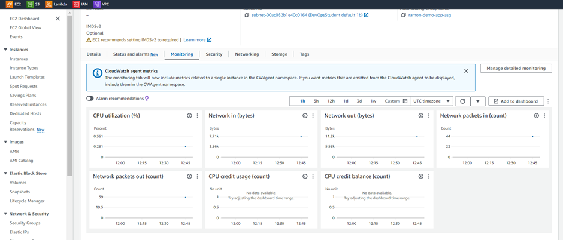

- Enable Detailed Monitoring:
  - Click on "Manage detailed monitoring" to enable detailed monitoring for the instance.
  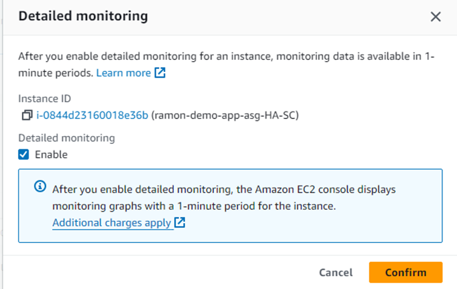
- Add to Dashboard:
  - You can also add the instance to a centralized dashboard by selecting "Add to dashboard".
  - Choose "Create new dashboard" and then add the instance to the dashboard.
  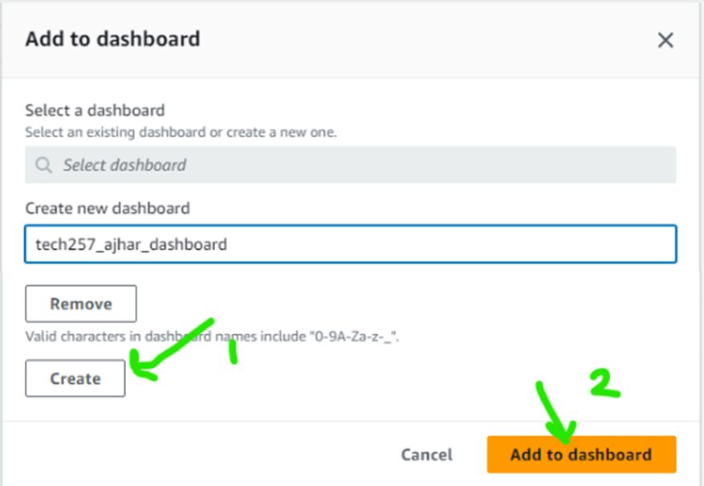

# Creating an Autoscaling Group

## Start with Launch Template
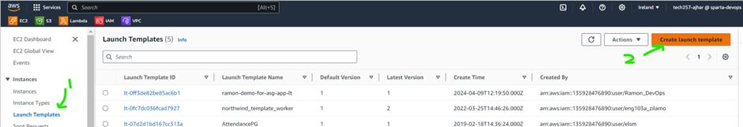

- Select the configuration for the app instance.
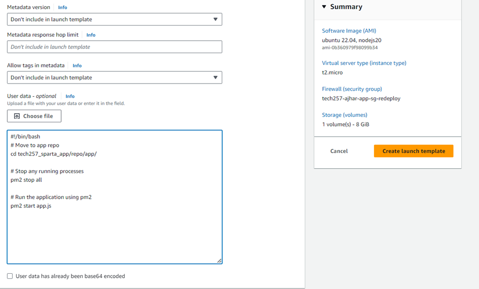
- Create a launch template.
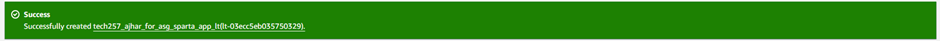
- Launch an instance using this template to test its functionality.
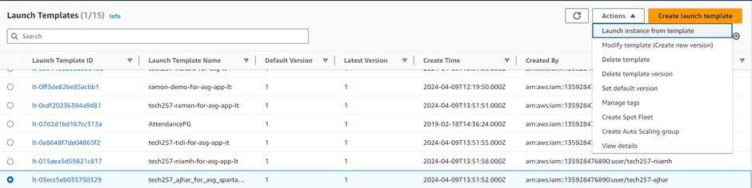
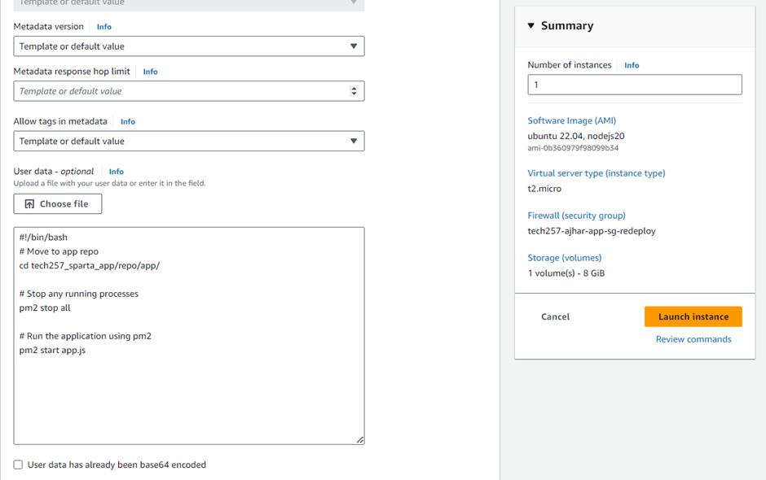
- Check application is working
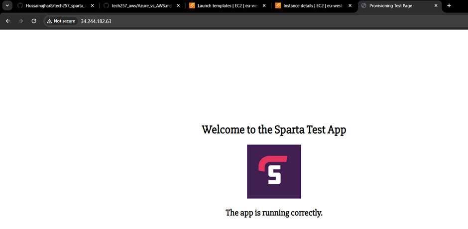

## Create Autoscaling Group
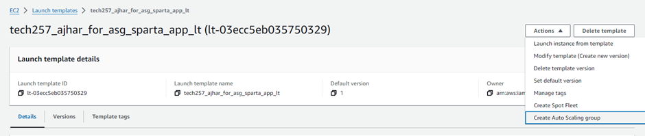
1. **Select Launch Template**:
   - Choose the launch template you created.
   
2. **Select VPC and Subnets**:
   - Specify the VPC and subnets for the autoscaling group.
   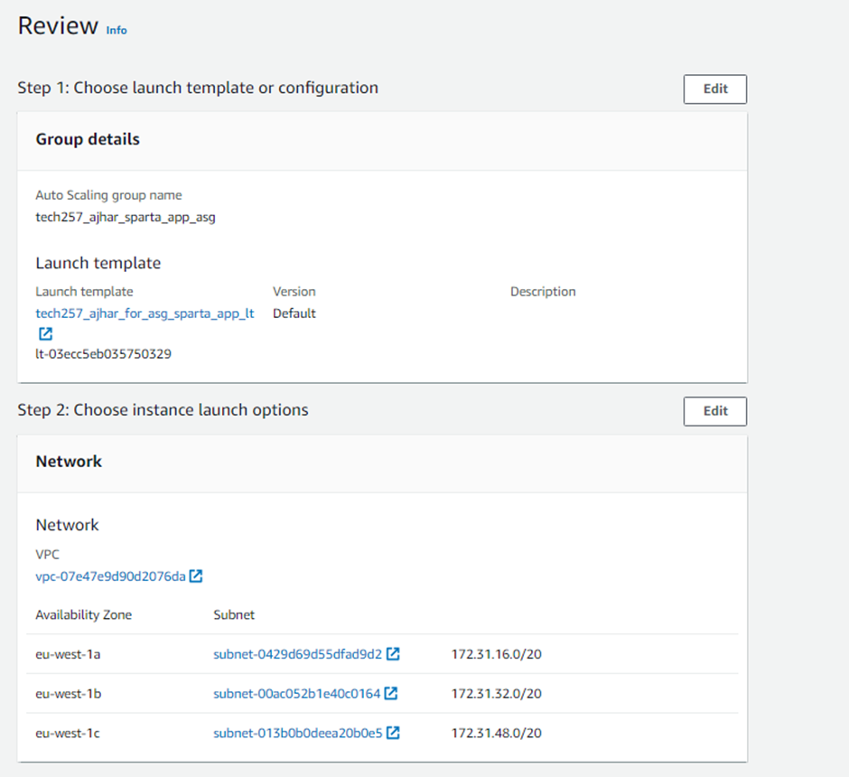

3. **Attach Load Balancer**:
   - Choose `Attach a new load balancer` and select `Application Load Balancer`.
   - Configure it as `internet-facing`, ensure port 80 is open, and create or select a target group.
   - Enable `Elastic Load Balancing health checks`.
  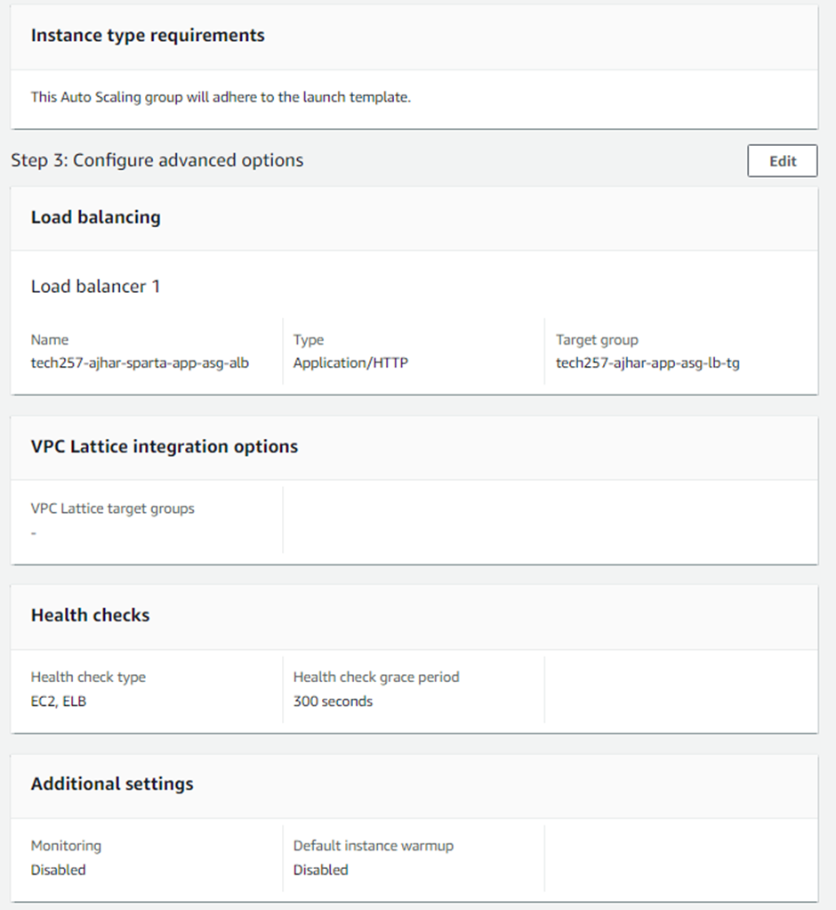

4. **Configure Autoscaling**:
   - Set minimum, desired, and maximum capacity.
   - Select a target tracking policy (e.g., 50% CPU utilization).
   - Choose "launch before terminating" as the policy behavior.
   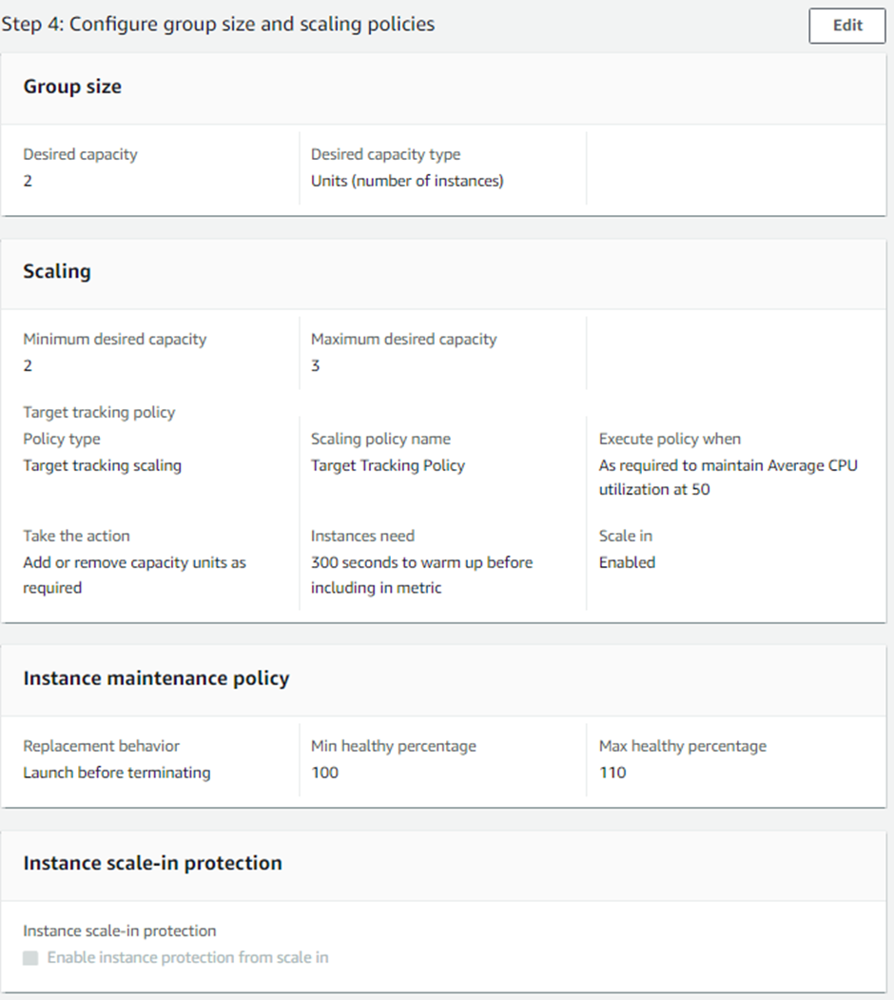

5. **Leave Default Configuration**:
   - Leave other settings as default.

6. **Add Tags**:
   - Associate tags with any created instances.
  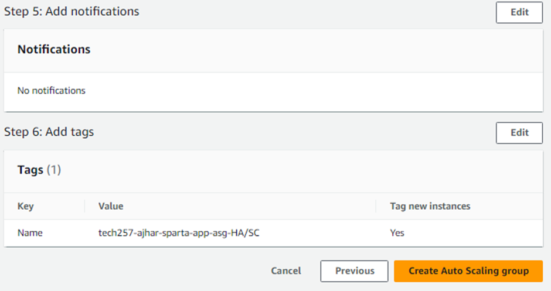

7. **Review and Create**:
   - Review the configuration and create the autoscaling group.
  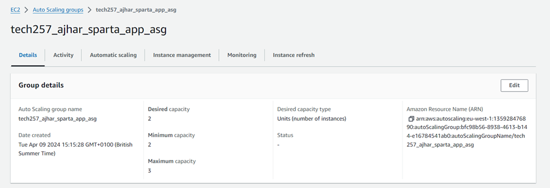

## Check Instances and Load Balancer

- Verify that instances are created from the autoscaling group.
  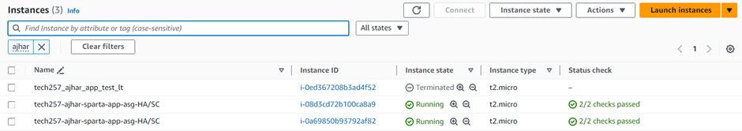
- Check the load balancer URL to ensure it connects to the application instances.
 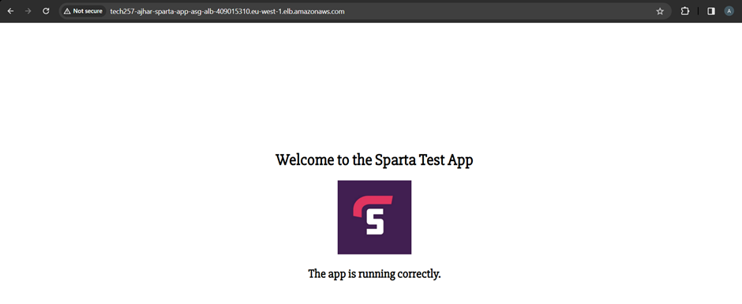

## Testing Autoscaling Group

To test the Autoscaling Group (ASG), terminate an instance and observe its behavior.

- Terminate an Instance:
  - Terminate one of the instances within the ASG.
  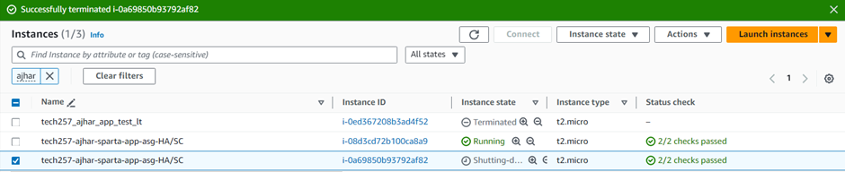

- Verify Load Balancer Behavior:
  - The load balancer should continue sending traffic to the terminated instance until it realises that the instance fails the health check.
  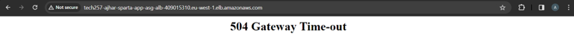

- New Instance Creation:
  - Once the terminated instance fails the health check, a new instance should be created by the ASG.
  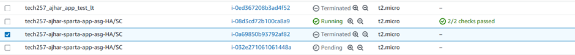
  - This confirms our autoscaling group maintaining the minimum set instances

## Cleaning Up

To clean up resources, follow these steps:

1. Delete Load Balancers:
  - Navigate to Load Balancers and delete the relevant load balancers.

2. Delete Target Groups:
  - Go to Target Groups and delete any associated target groups.

3. Delete Autoscaling Groups:
  - Remove the autoscaling groups from the AWS Management Console.
