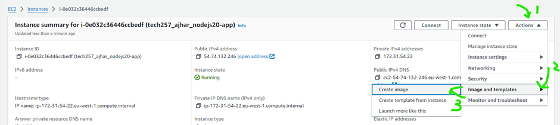
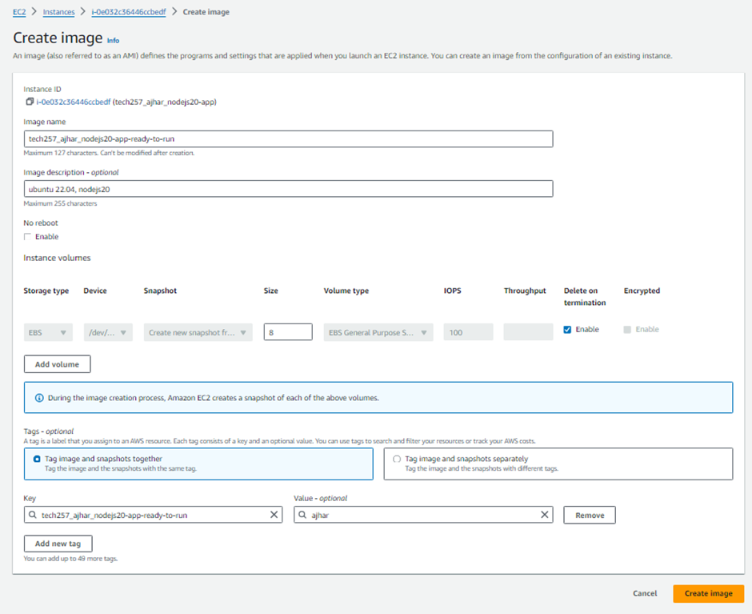
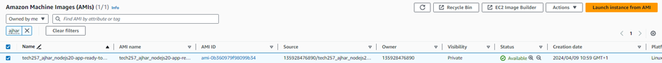
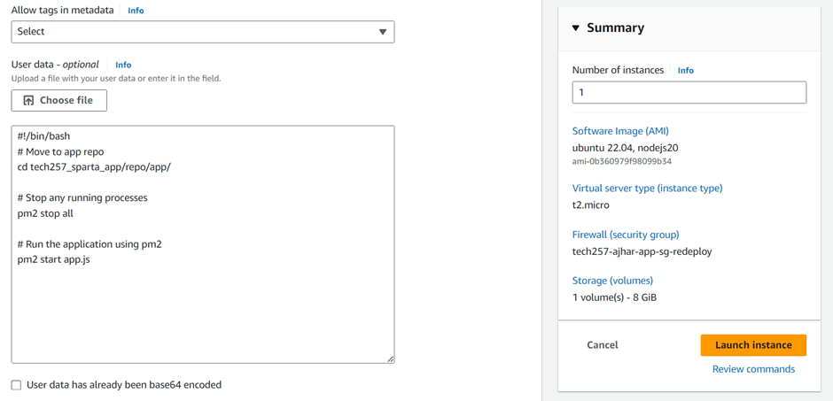
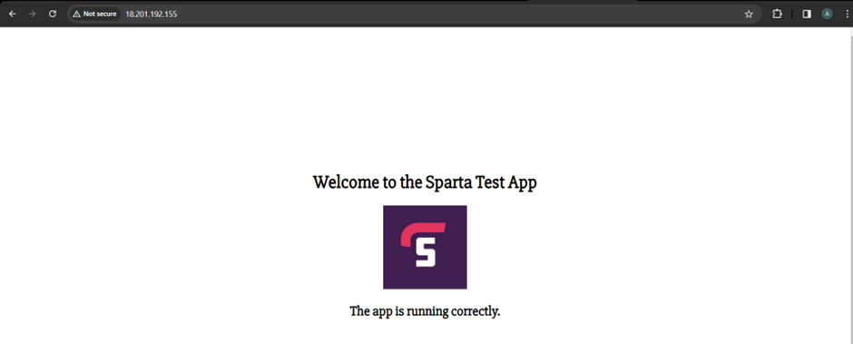
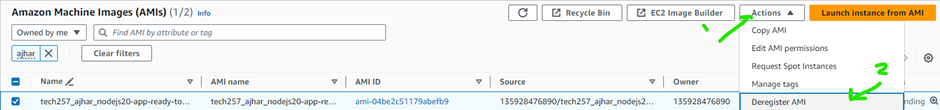
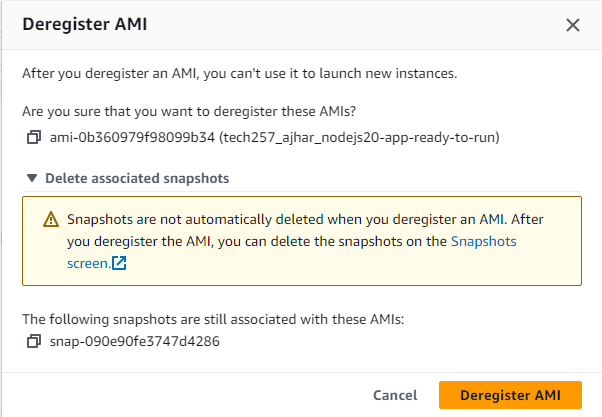
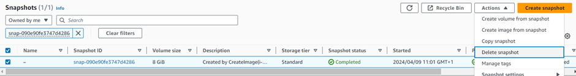
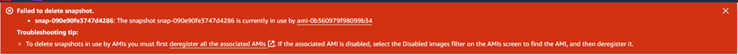

# Creating AMI

## 1. Create a Running Instance

Launch a running instance to create an AMI from.


## 2. Create Image from Instance

From the instance page, follow these steps:
   1. Click **Actions**.
   2. Select **Image and templates**.
   3. Choose **Create Image**.


   
Fill in the name, description, and tags for the AMI. Adjust the EBS storage as needed, then click **Create Image**.


## 3. Launch Instance from AMI

  1. Here we can see our ami is created and available.
   
  2. Because user-data does not rerun upon reboot, launch a new instance from the AMI to ensure the application runs upon boot. 
      - Include user-data for our use-case, such as:
        ```bash
        #!/bin/bash
        # Move to app repo
        cd tech257_sparta_app/repo/app/

        # Stop any running processes
        pm2 stop all

        # Run the application using pm2
        pm2 start app.js
        ```
  3. Fill in as needed and ensure to include user-data for our use-case
   

## 4. Verify Application

Ensure the application is running as intended on the new instance.


## 5. Clean Up

   - Delete the AMI:
     1. Click on your AMI and select **Deregister AMI**.
      
     2. Here we can see that we should delete the associated snapshot, copy the id and then proceed to delete the ami, after deleting the ami delete the snapshot.
      
      
     3. Delete the associated snapshot by copying the snapshot ID, then clicking on it, selecting **Actions**, and choosing **Delete Snapshot**. Confirm the deletion.
     
     4. (Note: Deleting the snapshot must be after deregistration of the AMI otherwise you will get the following error)
      
