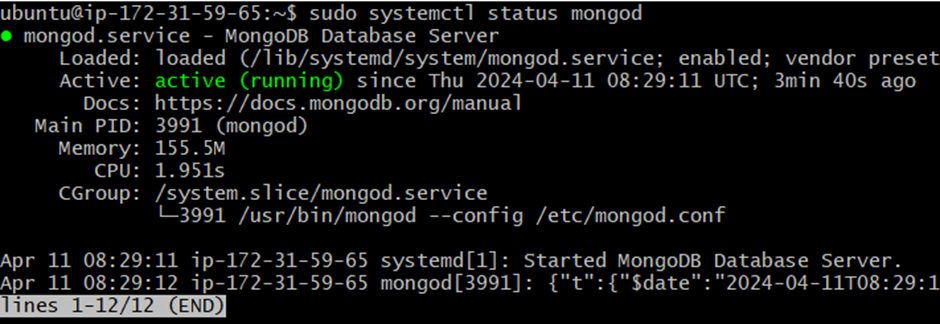

# Index

1. [Creating AMI](#creating-ami)
2. [Monitoring Instances](#monitoring-instances)
3. [Creating an Autoscaling Group](#creating-an-autoscaling-group)
4. [Create Database AMI](#create-database-ami)
5. [Creating a VPC](#creating-a-vpc)

# Creating AMI

## 1. Create a Running Instance

Launch a running instance to create an AMI from.


## 2. Create Image from Instance

From the instance page, follow these steps:
   1. Click **Actions**.
   2. Select **Image and templates**.
   3. Choose **Create Image**.


   
Fill in the name, description, and tags for the AMI. Adjust the EBS storage as needed, then click **Create Image**.


## 3. Launch Instance from AMI

  1. Here we can see our ami is created and available.
   
  2. Because user-data does not rerun upon reboot, launch a new instance from the AMI to ensure the application runs upon boot. 
      - Include user-data for our use-case, such as:
```bash
#!/bin/bash
# Move to app repo
cd tech257_sparta_app/repo/app/

# Stop any running processes
pm2 stop all

# Run the application using pm2
pm2 start app.js
```
  1. Fill in as needed and ensure to include user-data for our use-case
   

## 4. Verify Application

Ensure the application is running as intended on the new instance.


## 5. Clean Up

   - Delete the AMI:
     1. Click on your AMI and select **Deregister AMI**.
      
     2. Here we can see that we should delete the associated snapshot, copy the id and then proceed to delete the ami, after deleting the ami delete the snapshot.<br>
      
      
     3. Delete the associated snapshot by copying the snapshot ID, then clicking on it, selecting **Actions**, and choosing **Delete Snapshot**. Confirm the deletion.
     
     4. (Note: Deleting the snapshot must be after deregistration of the AMI otherwise you will get the following error)
      

# Monitoring Instances

To monitor instances, navigate to the instance and scroll down. Click on "Monitoring".


- Enable Detailed Monitoring:
  - Click on "Manage detailed monitoring" to enable detailed monitoring for the instance.
  
- Add to Dashboard:
  - You can also add the instance to a centralized dashboard by selecting "Add to dashboard".
  - Choose "Create new dashboard" and then add the instance to the dashboard.
  

# Creating an Autoscaling Group


## Start with Launch Template


- Select the configuration for the app instance.

- Create a launch template.

- Launch an instance using this template to test its functionality.


- Check application is working


## Create Autoscaling Group

1. **Select Launch Template**:
   - Choose the launch template you created.
   
2. **Select VPC and Subnets**:
   - Specify the VPC and subnets for the autoscaling group.
   

3. **Attach Load Balancer**:
   - Choose `Attach a new load balancer` and select `Application Load Balancer`.
   - Configure it as `internet-facing`, ensure port 80 is open, and create or select a target group.
   - Enable `Elastic Load Balancing health checks`.
  

4. **Configure Autoscaling**:
   - Set minimum, desired, and maximum capacity.
   - Select a target tracking policy (e.g., 50% CPU utilization).
   - Choose "launch before terminating" as the policy behavior.
   

5. **Leave Default Configuration**:
   - Leave other settings as default.

6. **Add Tags**:
   - Associate tags with any created instances.
  

7. **Review and Create**:
   - Review the configuration and create the autoscaling group.
  

## Check Instances and Load Balancer

- Verify that instances are created from the autoscaling group.
  
- Check the load balancer URL to ensure it connects to the application instances.
 

## Testing Autoscaling Group

To test the Autoscaling Group (ASG), terminate an instance and observe its behavior.

- Terminate an Instance:
  - Terminate one of the instances within the ASG.
  

- Verify Load Balancer Behavior:
  - The load balancer should continue sending traffic to the terminated instance until it realises that the instance fails the health check.
  

- New Instance Creation:
  - Once the terminated instance fails the health check, a new instance should be created by the ASG.
  
  - This confirms our autoscaling group maintaining the minimum set instances

## Cleaning Up

To clean up resources, follow these steps:

1. Delete Load Balancers:
  - Navigate to Load Balancers and delete the relevant load balancers.
  

2. Delete Target Groups:
  - Go to Target Groups and delete any associated target groups.
  

3. Delete Autoscaling Groups:
  - Remove the autoscaling groups from the AWS Management Console.<br>
 

# Create Database AMI

We should have a database image so that we can deploy a mongo database in a private subnet without any configurations:

1. **Create Database AMI**:
   - Launch an EC2 instance and install the database using the installation script.
   - SSH into the instance and confirm that the MongoDB service is running.
    
   - Create an image (AMI) from this instance.
    

2. **Test AMI**:
   - Launch a new instance from the AMI to ensure it works properly.
   - Try to connect to the application and check `/posts` to verify connectivity.
    

3. **Remove Running Instances**:
   - Once the AMI is confirmed to be working, remove any running instances as they are no longer needed.

4. **Update App User Data**:
   - Modify the user data of the application VM to export the database IP address.
   - Use the following script:
```bash
#!/bin/bash

# Connect to the database from application vm
export DB_HOST=mongodb://<private-ip-of-db>:27017/posts
# Move to app repo
cd tech257_sparta_app/repo/app/
# Install npm in the environment
npm -E install
# Stop any running processes
pm2 stop all
# Run the application using pm2
pm2 start app.js
 ```
        

# Creating a VPC

We will create our own Virtual Private Cloud (VPC) to isolate our resources and increase security for our two-tier deployment. Using a VPC allows us to have control over our network environment, enabling us to define our own IP address range, create subnets, and configure route tables and gateways, enhancing security by ensuring that our resources are only accessible within the defined network boundaries.


1. **Create VPC**:
   - Navigate to the VPC section and create a new VPC.
   - Set up the VPC with a `10.0.0.0/16` CIDR range and click "Create".
     

2. **Create Subnets**:
   - Click on the newly created VPC and create subnets.
   - Add a public subnet.
    
   - Add a private subnet. 
    
   - Ensure that both subnets are created successfully.
     

3. **Set Up Internet Gateway**:
   - Create an internet gateway (IG) and attach it to the VPC.
  
   - Select the VPC and attach the internet gateway.
   
   

4. **Create Public Route Table**:
   - Create a public route table.
     
   - Edit the route table subnet associations and add the public subnet.
     
   - Associate the route table with the internet gateway.
   - Add the internet gateway as a target with `0.0.0.0/0` as the destination.
     

5. **Confirm Configuration**:
   - Verify that the resource map for the VPC looks as intended.
   

6. **Launch Database VM**:
   - Launch a database VM from the AMI with the correct network settings.
    
   - Click "Launch" and ensure it is running.

7. **Launch Application VM**:
   - Launch an application VM from the AMI with the correct network settings.
    
   - Configure the user data to export the database host (`db_host`).
    
   - Click "Create" and verify that the application and `/posts` page work as expected.
     

8. **Clean Up**:
   - Remove instances.
   - Remove security groups.
   - Remove the VPC (this will also delete route tables and subnets).

# Simple Storage Service (S3)

## Advantages:
- **Limitless/Scalable**: S3 offers virtually unlimited storage capacity, allowing you to scale your storage needs as your data grows.
- **Secure**: By default, S3 buckets are private and access to objects can be controlled through permissions, making it highly secure.
- **Accessible**: S3 can be accessed from anywhere with an internet connection, providing URLs and endpoints for easy access.
- **Redundancy and Durability**: S3 is designed with built-in redundancy, ensuring high durability and reliability with a high Service Level Agreement (SLA).

## Getting Started:
1. **Launch EC2 Instance**:
   - Launch an EC2 instance with Ubuntu 22.04 and port 22 open.
   

2. **SSH into Instance and Update**:
   - SSH into the instance and perform an update and upgrade:
     ```
     sudo apt update -y
     sudo apt upgrade -y
     ```

3. **Install AWS CLI**:
   - Install Python pip and then install AWS CLI:
     ```
     sudo apt install python3-pip -y
     sudo pip install awscli
     ```

4. **Configure AWS CLI**:
   - Run `aws configure` to log in to your AWS account.
    

5. **Create S3 Bucket**:
   - Create an S3 bucket using the AWS CLI:
     ```
     aws s3 mb s3://<s3_name>
     ```
     

6. **Upload and Manage Objects**:
   - Upload a file to the S3 bucket:
     ```
     aws s3 cp <file> <bucket_destination>
     ```
   - List the contents of the bucket to confirm the upload:
     ```
     aws s3 ls <bucket>
     ```
     
     
   - Download the contents of the bucket locally:
     ```
     aws s3 sync <bucket_path> <directory_destination>
     ```
     
   - Upload files from a local directory to the bucket:
     ```
     aws s3 sync <directory_path> <bucket_destination>
     ```

7. **Remove Objects and Buckets**:
   - :warning: Remove a specific file from the bucket:
     ```
     aws s3 rm <bucket_file_path>
     ```
   - :warning: Remove all files in a bucket:
     ```
     aws s3 rm --recursive <bucket>
     ```
     
   - :warning: Delete a bucket along with its files:
     ```
     aws s3 rb --force <bucket_name>
     ```
     
