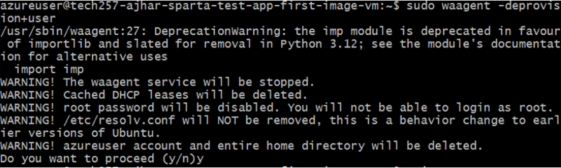
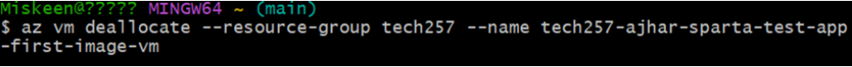
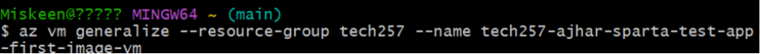

# Differences between Azure and AWS

## AMI Creation

In Azure, you will have to run the waagent deprovision user command in the virtual machine and then deallocate and generalize the VM from the terminal. However, in AWS, It's much more straighforward - it reboots the virtual machine however so note that user data will not re-run.

### Azure:
- Get an instance that you'd like to make an image up and running.
- Run `sudo waagent -deprovision+user` in the virtual machine.
  
- Using Azure CLI, Deallocate and generalize the VM from the terminal.
  `az vm deallocate --resource-group <resource-group-name> --name <vm-name>`  
  `az vm generalize --resource-group <resource-group-name> --name <vm-name>`  
- On the Azure portal, navigate to the VM page and click on "Capture" to capture the VM image.
- Create an image from the instance, providing name, description, storage and tags.

### AWS:
- Get an instance that you'd like to make an image up and running.

- Create an image from the instance, providing name, description, storage and tags.

## Clean Up

### Azure:
- Using Azure CLI, Deallocate and generalize the VM.
- Delete the image.

### AWS:
- Delete the AMI:
  - Deregister the AMI.
  - Delete the associated snapshot.
