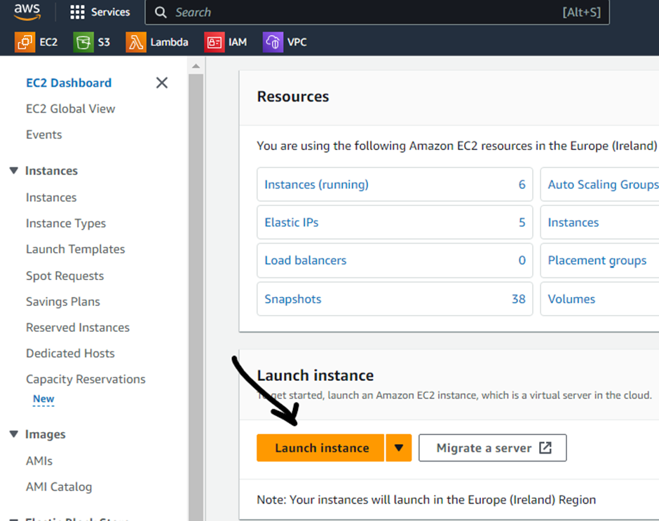
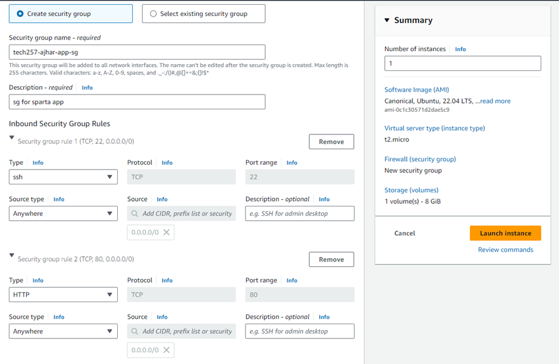
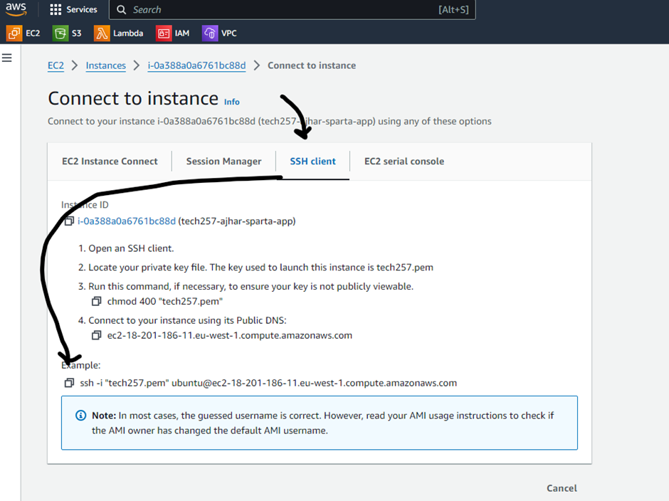
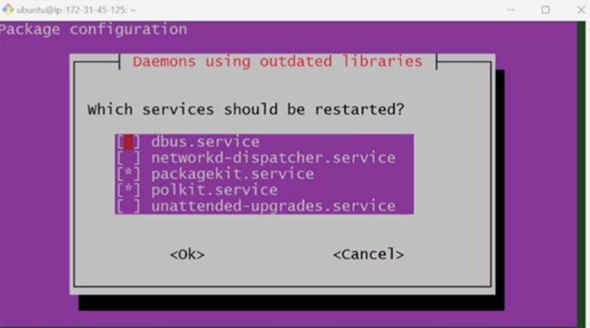
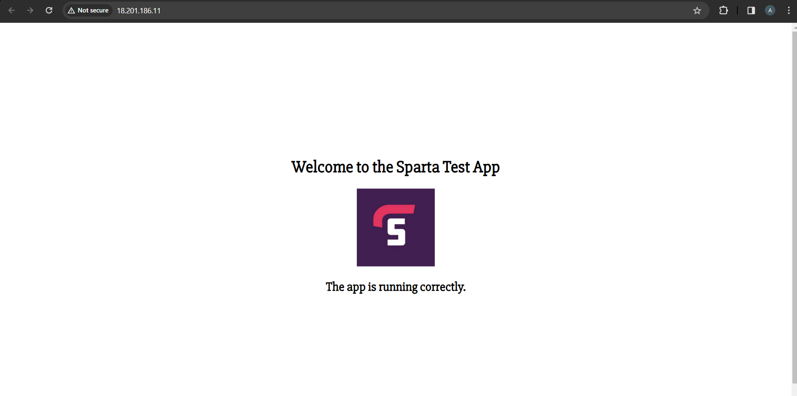
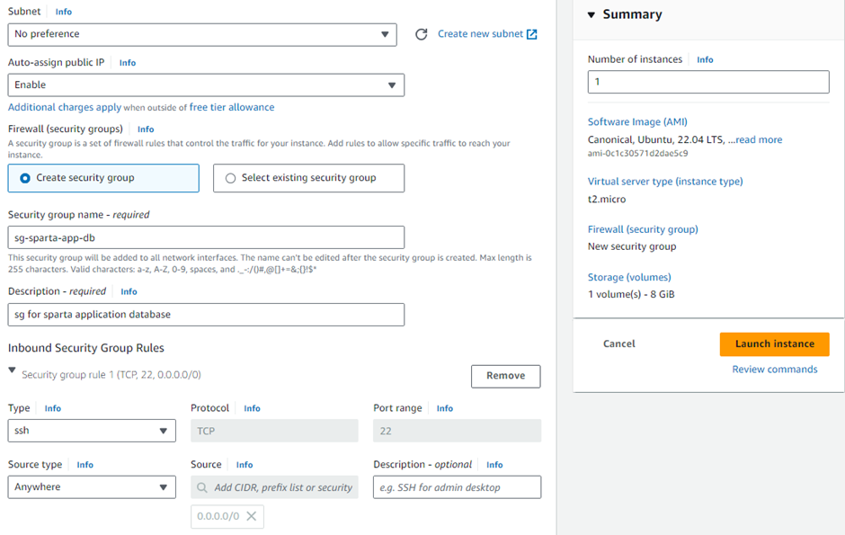
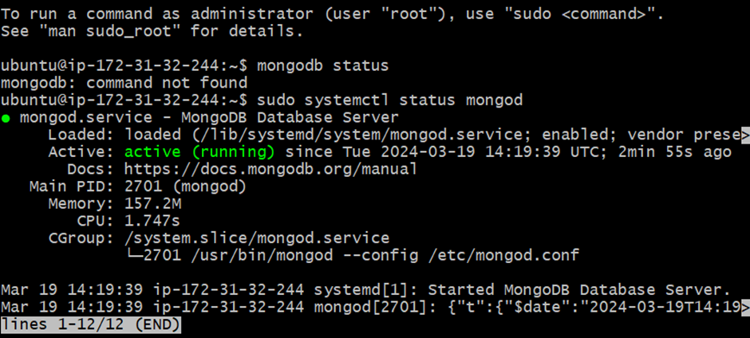
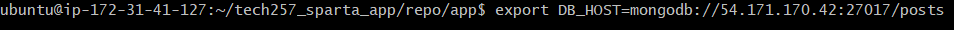
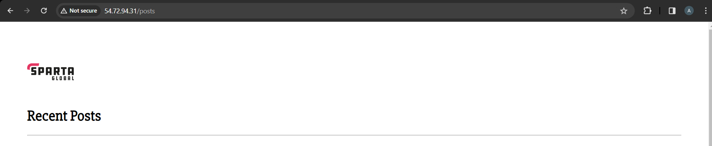

### Launching an AWS EC2 Instance

1. Log into the AWS console.
2. Navigate to the EC2 section and click on "Launch Instance." 
3. Fill in the instance details, ensuring to select a Ubuntu 22.04 img/readme_img/image and t2.micro instance type.
4. Select "tech257" as the key pair and ensure it has been downloaded and placed in the `.ssh/` folder.
5. Edit the security group, rename it appropriately, and open ports 80 and 22. Port 3000 is not required to be opened as we will configure a reverse proxy.
6. Launch the instance when the EC2 configuration is complete.


### Connecting to the EC2 Instance

1. Once the instance is initialized, open it and click on "Connect" and then "SSH client" to SSH into the virtual machine. Copy and paste the command into a Git Bash terminal.


### Configuring the Instance

1. Update and upgrade the system by running the following commands:
   - `sudo apt update -y`
   - `sudo DEBIAN_FRONTEND=noninteractive apt upgrade -y`<br>
   Note: The `DEBIAN_FRONTEND=noninteractive` flag is important to ensure there are no user prompts which might interrupt our scripts.

2. Install Nginx:<br>
   `sudo DEBIAN_FRONTEND=noninteractive apt install nginx -y`<br>
   Note: Using `DEBIAN_FRONTEND=noninteractive` bypasses prompts that may arise during scripted deployments.

3. Install Node.js:<br>
    ```bash
    curl -fsSL https://deb.nodesource.com/setup_20.x | sudo DEBIAN_FRONTEND=noninteractive -E bash -
    sudo DEBIAN_FRONTEND=noninteractive apt-get install -y nodejs
    ```
    - (If we didn’t use the DEBIAN_FRONTEND=noninteractive we would of gotten the following prompt)<br>
    
    - This isn’t an issue now when deploying the application manually, but it should be bypassed when scripting. <br>
    - Another solution to the restart prompt is to enable it automatically in the needrestart.conf file which can be found in `/etc/needrestart/needrestart.conf`, you would need to edit `#$nrconf{restart} = 'i'`; to `#$nrconf{restart} = 'a'`;, this could be done manually using `sudo nano /etc/needrestart/needrestart.conf` and in a script using the `sed` command.


4. Clone the application repository into the VM:<br>
  `git clone https://github.com/Hussainajhar8/tech257_sparta_app.git`

1. Configure a reverse proxy to redirect traffic from port 80 to the application running on port 3000:<br> `sudo sed -i '51s/.*/ proxy_pass http://localhost:3000;/' /etc/nginx/sites-available/default`


6. Reload Nginx to apply the changes:<br>
  `sudo DEBIAN_FRONTEND=noninteractive systemctl reload nginx`

7. Change directory into the application folder, install dependencies, and start the application using PM2:<br>
    ```bash
    cd tech257_sparta_app/repo/app/
    sudo DEBIAN_FRONTEND=noninteractive npm install
    sudo DEBIAN_FRONTEND=noninteractive npm install pm2@latest -
    pm2 kill
    pm2 start app.js
    ```
The end product should be a working application!

To automate this process we can write this all as a script and enter this as user data upon creating and launching an instance

### Final script
```bash
#!/bin/bash

# Update and upgrade the system, `DEBIAN_FRONTEND=noninteractive` to bypass user-prompts
sudo DEBIAN_FRONTEND=noninteractive apt update -y
sudo DEBIAN_FRONTEND=noninteractive apt upgrade -y

# Install nginx
sudo DEBIAN_FRONTEND=noninteractive apt install nginx -y

# Start and enable nginx
sudo DEBIAN_FRONTEND=noninteractive systemctl restart nginx
sudo DEBIAN_FRONTEND=noninteractive systemctl enable nginx

# Install nodejs
curl -fsSL https://deb.nodesource.com/setup_20.x | sudo DEBIAN_FRONTEND=noninteractive -E bash -
sudo DEBIAN_FRONTEND=noninteractive apt-get install -y nodejs

# Clone the repository
git clone https://github.com/Hussainajhar8/tech257_sparta_app.git

# Configure reverse proxy
sudo sed -i '51s/.*/                proxy_pass http:\/\/localhost:3000;/' /etc/nginx/sites-available/default

# Reload Nginx to apply changes
sudo DEBIAN_FRONTEND=noninteractive systemctl reload nginx

# Move to the app directory
cd tech257_sparta_app/repo/app/

# Install npm
sudo DEBIAN_FRONTEND=noninteractive npm install

# Install pm2
sudo DEBIAN_FRONTEND=noninteractive npm install pm2@latest -g

# Kill any pm2 processes
pm2 kill

# Start the app
pm2 start app.js

# Save the process
pm2 save
```
### 2-Tier Deployment on AWS

#### Deploying the Database Instance

1. Log into the AWS console.
2. Navigate to the EC2 section and click on "Launch Instance."
3. Fill in the instance details, ensuring to select a Ubuntu 22.04 img/readme_img/image and t2.micro instance type.
4. Select "tech257" as the key pair and ensure it has been downloaded and placed in the `.ssh/` folder.
5. Edit the security group, rename it appropriately, and open port 22 only.
6. Launch the instance when the EC2 instance has been configured properly.


#### Connecting to the Database Instance

1. Once the instance is initialized, open it and click on "Connect" and then "SSH client" to SSH into the virtual machine. Copy and paste the command into a Git Bash terminal.

#### Configuring the Database Instance

1. Update and upgrade the system by running the following commands:
   - `sudo apt update -y`
   - `sudo DEBIAN_FRONTEND=noninteractive apt upgrade -y`

2. Install dependencies for MongoDB if they’re not already installed:
   - `sudo apt-get install gnupg curl`

3. Add MongoDB GPG Key:
   - `curl -fsSL https://www.mongodb.org/static/pgp/server-7.0.asc | sudo gpg -o /usr/share/keyrings/mongodb-server-7.0.gpg –dearmor`

4. Add the MongoDB repository, update it, and install MongoDB:
   - `echo "deb [ arch=amd64,arm64 signed-by=/usr/share/keyrings/mongodb-server-7.0.gpg ] https://repo.mongodb.org/apt/ubuntu jammy/mongodb-org/7.0 multiverse" | sudo tee /etc/apt/sources.list.d/mongodb-org-7.0.list`
   - Update the repository: `sudo apt-get update`
   - Install MongoDB:
    `sudo apt-get install -y mongodb-org=7.0.6 mongodb-org-database=7.0.6 mongodb-org-server=7.0.6 mongodb-mongosh=2.1.5 mongodb-org-mongos=7.0.6 mongodb-org-tools=7.0.6`

5. Hold package versions to prevent automatic updates:
```bash
echo "mongodb-org hold" | sudo dpkg --set-selections
echo "mongodb-org-database hold" | sudo dpkg --set-selections
echo "mongodb-org-server hold" | sudo dpkg --set-selections
echo "mongodb-mongosh hold" | sudo dpkg --set-selections
echo "mongodb-org-mongos hold" | sudo dpkg --set-selections
echo "mongodb-org-tools hold" | sudo dpkg --set-selections
```

6. Configure MongoDB Bind IP by modifying the MongoDB configuration file: `sudo vim /etc/mongod.conf`
     - Change bind ip to 0.0.0.0.
  
7. Start the MongoDB service:<br>
    - `sudo systemctl start mongod`
    - `sudo systemctl enable mongod`

8. Check the MongoDB service status: `sudo systemctl status mongod`


### Connecting Application to MongoDB
1. Set the environment variable to connect the application to the MongoDB database:
    - SSH into the application VM.
    - Set up the environment variable:
    - `export DB_HOST=mongodb://<public-or-private-ip-of-database>:27017/posts`
   
2. Stop the current application process:
Change into the app directory and install npm and start the app:
    - `cd tech257_sparta_app/repo/app/`
    - sudo -E npm install
    - sudo -E npm install pm2@latest -g
    - pm2 kill
    - pm2 start app.js
  <br>

3. Make sure the security group for the database has an inbound rule open on port 27017

Verify the connection by checking if the application is connected properly: 
- Add the /posts extension to the application address (<application-domain>/posts). This should display the correct webpage.



## Bash Script for Database Deployment:
```bash
#!/bin/bash

# Update and upgrade the system
sudo apt-get update
sudo DEBIAN_FRONTEND=noninteractive apt-get upgrade -y

# Install dependencies
sudo apt-get install gnupg curl

# Add MongoDB GPG Key
curl -fsSL https://www.mongodb.org/static/pgp/server-7.0.asc | sudo gpg -o /usr/share/keyrings/mongodb-server-7.0.gpg --dearmor

# Add MongoDB Repository
echo "deb [ arch=amd64,arm64 signed-by=/usr/share/keyrings/mongodb-server-7.0.gpg ] https://repo.mongodb.org/apt/ubuntu jammy/mongodb-org/7.0 multiverse" | sudo tee /etc/apt/sources.list.d/mongodb-org-7.0.list

# Update Repository
sudo apt-get update

# Install MongoDB
sudo apt-get install -y mongodb-org=7.0.6 mongodb-org-database=7.0.6 mongodb-org-server=7.0.6 mongodb-mongosh=2.1.5 mongodb-org-mongos=7.0.6 mongodb-org-tools=7.0.6

# Hold Package Versions
echo "mongodb-org hold" | sudo dpkg --set-selections
echo "mongodb-org-database hold" | sudo dpkg --set-selections
echo "mongodb-org-server hold" | sudo dpkg --set-selections
echo "mongodb-mongosh hold" | sudo dpkg --set-selections
echo "mongodb-org-mongos hold" | sudo dpkg --set-selections
echo "mongodb-org-tools hold" | sudo dpkg --set-selections

# Configure MongoDB Bind IP
sudo sed -i 's@127.0.0.1@0.0.0.0@' /etc/mongod.conf

# Start MongoDB Service
sudo systemctl start mongod
sudo systemctl enable mongod
```