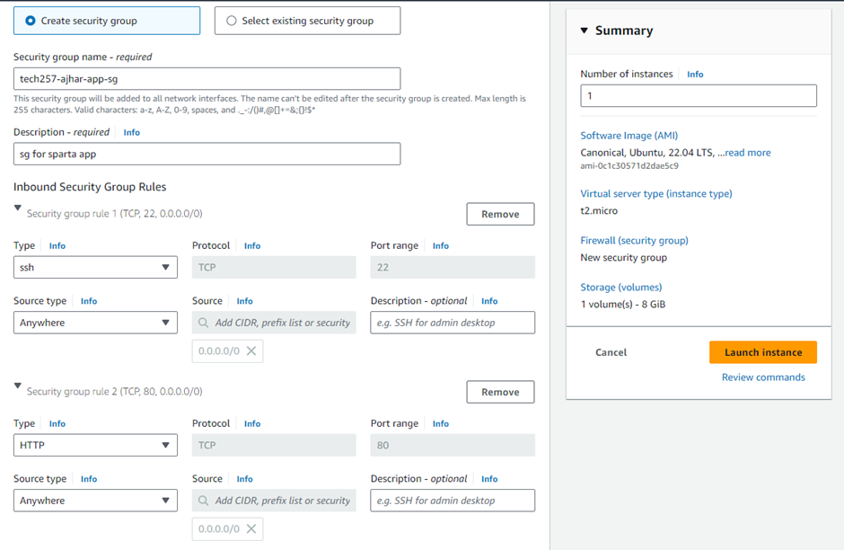

### Launching an AWS EC2 Instance

1. Log into the AWS console.
2. Navigate to the EC2 section and click on "Launch Instance." 
3. Fill in the instance details, ensuring to select a Ubuntu 22.04 image and t2.micro instance type.
4. Select "tech257" as the key pair and ensure it has been downloaded and placed in the `.ssh/` folder.
5. Edit the security group, rename it appropriately, and open ports 80 and 22. Port 3000 is not required to be opened as we will configure a reverse proxy.
6. Launch the instance when the EC2 configuration is complete.


### Connecting to the EC2 Instance

1. Once the instance is initialized, open it and click on "Connect" and then "SSH client" to SSH into the virtual machine. Copy and paste the command into a Git Bash terminal.


### Configuring the Instance

1. Update and upgrade the system by running the following commands:
   - `sudo apt update -y`
   - `sudo DEBIAN_FRONTEND=noninteractive apt upgrade -y`
   Note: The `DEBIAN_FRONTEND=noninteractive` flag is important to ensure there are no user prompts which might interrupt our scripts.

2. Install Nginx:
   - `sudo DEBIAN_FRONTEND=noninteractive apt install nginx -y`
   Note: Using `DEBIAN_FRONTEND=noninteractive` bypasses prompts that may arise during scripted deployments.

3. Install Node.js:
  - ```bash
    curl -fsSL https://deb.nodesource.com/setup_20.x | sudo DEBIAN_FRONTEND=noninteractive -E bash -
    sudo DEBIAN_FRONTEND=noninteractive apt-get install -y nodejs
    ```

4. Clone the application repository into the VM:
- `git clone https://github.com/Hussainajhar8/tech257_sparta_app.git`

5. Configure a reverse proxy to redirect traffic from port 80 to the application running on port 3000: `sudo sed -i '51s/.*/ proxy_pass http://localhost:3000;/' /etc/nginx/sites-available/default`


6. Reload Nginx to apply the changes:
- `sudo DEBIAN_FRONTEND=noninteractive systemctl reload nginx`

7. Change directory into the application folder, install dependencies, and start the application using PM2:
 -  ```bash
    cd tech257_sparta_app/repo/app/
    sudo DEBIAN_FRONTEND=noninteractive npm install
    sudo DEBIAN_FRONTEND=noninteractive npm install pm2@latest -
    pm2 kill
    pm2 start app.js
    ```
The end product should be a working application!

To automate this process we can write this all as a script and enter this as user data upon creating and launching an instance

### Final script
```bash
#!/bin/bash

# Update and upgrade the system, `DEBIAN_FRONTEND=noninteractive` to bypass user-prompts
sudo DEBIAN_FRONTEND=noninteractive apt update -y
sudo DEBIAN_FRONTEND=noninteractive apt upgrade -y

# Install nginx
sudo DEBIAN_FRONTEND=noninteractive apt install nginx -y

# Start and enable nginx
sudo DEBIAN_FRONTEND=noninteractive systemctl restart nginx
sudo DEBIAN_FRONTEND=noninteractive systemctl enable nginx

# Install nodejs
curl -fsSL https://deb.nodesource.com/setup_20.x | sudo DEBIAN_FRONTEND=noninteractive -E bash -
sudo DEBIAN_FRONTEND=noninteractive apt-get install -y nodejs

# Clone the repository
git clone https://github.com/Hussainajhar8/tech257_sparta_app.git

# Configure reverse proxy
sudo sed -i '51s/.*/                proxy_pass http:\/\/localhost:3000;/' /etc/nginx/sites-available/default

# Reload Nginx to apply changes
sudo DEBIAN_FRONTEND=noninteractive systemctl reload nginx

# Move to the app directory
cd tech257_sparta_app/repo/app/

# Install npm
sudo DEBIAN_FRONTEND=noninteractive npm install

# Install pm2
sudo DEBIAN_FRONTEND=noninteractive npm install pm2@latest -g

# Kill any pm2 processes
pm2 kill

# Start the app
pm2 start app.js


# Save the process
pm2 save
```